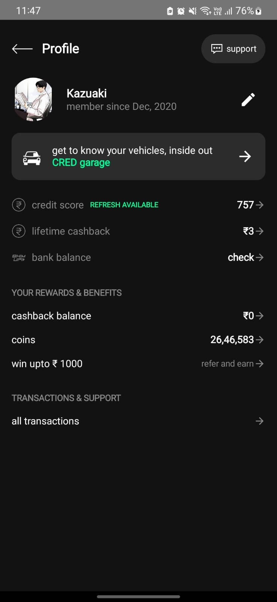

# 🚀 Profile UI – Internship Assignment

This is a modern **Profile Screen UI** built using **Jetpack Compose** in **Kotlin** as part of an internship assignment.

It follows clean design principles, dark theme aesthetics, and interactive components, showcasing both UI skills and Jetpack Compose proficiency.

---

## 🛠️ Technologies Used

- 🧠 **Kotlin**
- 🎨 **Jetpack Compose**
- 📱 **Material 3 UI Components**
- 🖼️ **Vector Icons & Custom Drawables**
- 🌌 **Dark Theme Styling**

---

## 📸 Screenshot

### 🧑‍💼 Profile Screen



---

## ✅ Features

- Custom **top app bar** with back and support icons  
- Profile header with editable name and avatar  
- Interactive **CRED Garage** card section  
- Clean display of:
  - Credit score  
  - Lifetime cashback  
  - Bank balance  
- **Rewards & Benefits** UI blocks  
- Organized **transaction & support** section  
- Fully responsive with Compose best practices  

---

## 📂 Folder Structure

```plaintext
Internship Assignment/
├── Profile/           # Android app using Jetpack Compose
├── screenshots/       # Contains app screenshots
│   └── profile_screen.jpeg
└── README.md          # Project overview and documentation

## 🤝 Contact
For any questions, feedback, or opportunities:

Nishant
📧 nishant.kumar83358@gmail.com
🔗 LinkedIn  https://www.linkedin.com/in/nishant-kumar-958b36281?utm_source=share&utm_campaign=share_via&utm_content=profile&utm_medium=android_app
